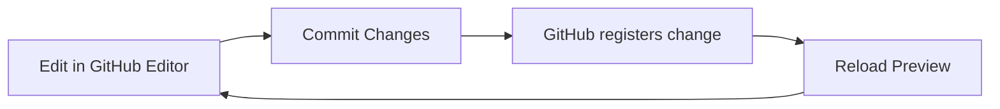

# Juncture Authoring Guide

*(GitHub Website + Live Preview Workflow)*

This guide explains how to create, preview, and publish posts using GitHub’s web editor and the custom Juncture live preview tool.

## 1. One-Time Preview Tool Setup (Do This Once)

**The Juncture Preview Tool**

When you commit changes on GitHub, the site does **not** update immediately.

Behind the scenes:

* GitHub Pages must rebuild the entire Jekyll site
* All Markdown files are processed
* Layouts, includes, and components are rendered
* The generated site is then redeployed

This usually takes 1–5 minutes which means there is a significant delay between making a change and seeing the result.  The **Preview tool** avoids that wait by rendering just your post directly from the repository. You can see changes in seconds instead of minutes.  To use the Preview Tool a one-time setup is needed.  This only takes a couple minutes.

Using the **[Preview Setup Guide](juncture-preview-setup)**, configure the Preview Tool for quickly previewing committed edits.

You only do this once per browser.

---

## 2. Creating a New Post

*(Example: Monument Valley)*

Go to `_posts`.

Open `.template.md` and copy the contents.

Create a new file using a filename formatted `YYYY-MM-DD-<Post_Title>.md`, for example"

```
2026-01-10-monument-valley.md
```

Paste the template contents into the newly created file and edit the front matter.  When finished with updating the front matter, commit (save) the file.

---

## 3. Completing the Front Matter

Example based on the [Monument Valley post]({{ site.baseurl }}/monument-valley):

```yaml
---
title: Monument Valley
description: Interactive visual essay on Monument Valley.
authors:
  - Ron Snyder
date: 2026-01-10
categories: [examples]
tags: [Monument Valley]
published: false
pin: true
media_subpath: /assets/posts/monument-valley
image:
  path: Monument_Valley.jpg
  alt: Monument Valley
juncture: true
---
```

#### Key Points

* `published: false` while drafting
* `media_subpath` must exactly match the folder name created in the `/assets/posts` folder
* `image.path` uses filename only
* Juncture settings may be a boolean or an object

---

## 4. Images and Assets (Monument Valley Example)

This is an optional step to be performed in locally hosted content (generally images) will be used in the post.

### Step 1 — Create Folder

```
/assets/posts/monument-valley/
```

Upload any local images used in post:

```
Monument_Valley.jpg
```

### Step 2 — Match media_subpath

```yaml
media_subpath: /assets/posts/monument-valley
```

Exact spelling matters.

### Step 3 — Reference Only Filenames

When `media_subpath` is set in the post front matter only filenames are used in image and Juncture tags.

#### Markdown image

```markdown

```

Not:

```
/assets/posts/monument-valley/Monument_Valley.jpg
```

The system automatically resolves the full path.

If an image doesn’t load, check that the folder name matches `media_subpath` exactly.

---

## 5. Invoking the Live Preview

### Open the Post in GitHub

1. Go to your repository.
2. Navigate to `_posts`.
3. Click on the post to be edited (e.g., `2026-01-10-monument-valley.md`).
4. Click the **✏️ pencil icon** to edit.

> You must be on the `.md` file page.

---

### Launch the Preview

While on that GitHub page:

1. Click the **“Preview on GitHub”** bookmark in your bookmarks bar (added in the *One-Time Preview Tool Setup* above).
2. A new tab/window opens with the fully rendered preview.

If nothing happens:

* Confirm you are on a `.md` file page
* Confirm the bookmarklet is installed

---

### Arrange Side-by-Side

As a convenience it can be useful to position these side-by-side on your computer display, editing in one window and previewing the edits in another.  This enables rapid iteration.  After committing a change in the GitHub editor press the refresh button in the preview tool to see the changes.

---

## 6. The Fast Edit → Commit → Preview Loop

1. Edit in GitHub
2. Click **Commit changes**
3. Wait ~5 seconds
4. Click **Reload** in the preview

Repeat as needed.

---

### Workflow Diagram



The preview renders instantly from the repo — no full site rebuild required.

---

## 7. Juncture Features

A basic post is created using using plain text and standard Markdown tags.  These Chirpy guides provide information on writing text-based posts using Markdown formatting.

- [Text and Typography](text-and-typography)
- [Writing a New Post](write-a-new-post)

Using the Juncture extensions interactive images, maps, videos and more can easily be added to a post using simple tags.  More information on the Juncture extensions can be found in the following guides.

- [Juncture Overview](juncture-overview)
- [Image viewer](juncture-image-viewer)
- [Map Viewer](juncture-map-viewer)
- [Image Compare Viewer](juncture-image-compare-viewer)
- [YouTube Viewer](juncture-youtube-viewer)
- [Entity Info Popups](juncture-entity-info-popups)

---

## 8. Publishing

When satisfied:

Change:

```yaml
published: true
```

Commit.

The public site updates after GitHub completes its normal rebuild (typically in 1-5 minutes).

---

## 9. Troubleshooting

**Preview outdated?**
Wait a few seconds and reload again.

**API rate limit warning?**
Re-enter your PAT in preview config.

**Images not showing?**
Check:

* `media_subpath`
* Folder name
* Exact filename match

**Embed shows placeholder?**
Confirm required `_includes/embed/` files exist.

---

## Final Author Checklist

* Correct filename format
* Front matter complete
* `media_subpath` matches folder exactly
* Images uploaded
* Only filenames used
* Juncture enabled if needed
* `published: true` when ready
